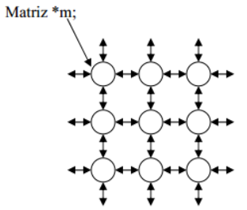

# matriz

## Objetivo

Desenvolver funções com base nos conceitos de listas e encadeamento para simular e 
manipular uma matriz padrão bidimensional através de encadeamento e seus ponteiros

## Escopo

Definir uma estrutura de dados para fazer a alocação de uma matriz bidimensional de 
inteiros com o uso de listas encadeadas. Cada elemento da “matriz”, pode acessar o seu 
vizinho a esquerda, direita, cima ou baixo via ponteiros, caso não existem o ponteiro 
deve ser nulo. A ideia é utilizarmos essa matriz encadeada como se fosse uma matriz 
convencional

